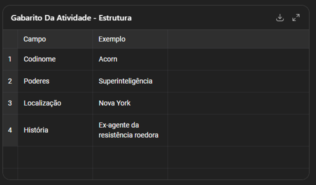
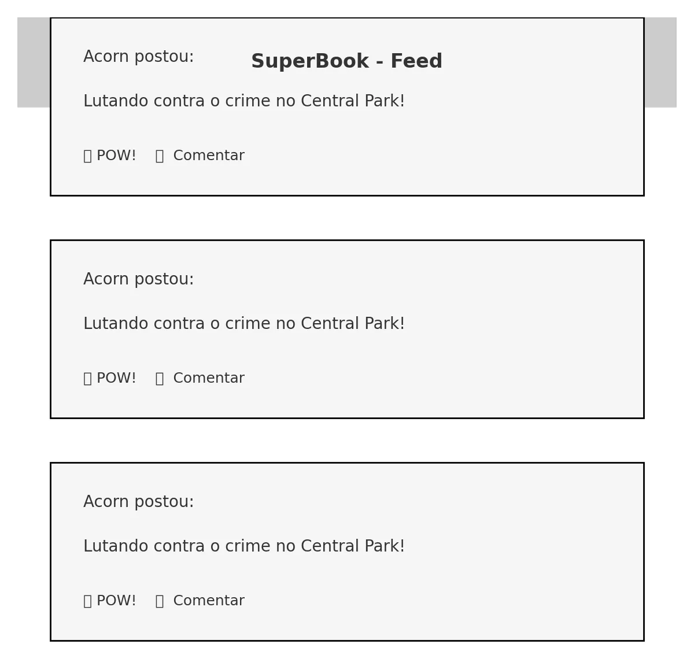

# Análise de requisitos do Superbook: Gabarito

### 

A estrutura de campos sugerida para o perfil no SuperBook está disponível acima como gabarito. A seguir, estão os **dois esboços de tela** gerados com base na proposta da atividade:

1. **Tela de Perfil do Herói**
2. **Feed do SuperBook com posts e interações**

Aqui estão os esboços das telas do aplicativo SuperBook que compõem o **gabarito visual** da atividade:

### 🧾 Tela de Perfil do Herói:

- Mostra a imagem do usuário
- Exibe codinome, poderes, localização e história

### 📰 Feed do SuperBook:

- Apresenta postagens simples
- Possui opções de interação como “POW!” e comentar

