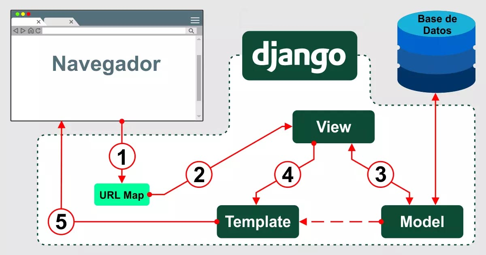

# Django: Uma visão Geral

O Django é um **framework web de alto nível, escrito em Python**, que visa encorajar o desenvolvimento limpo e rápido de aplicações web. Ele é conhecido por ser uma ferramenta completa, robusta e de fácil implementação.

Seu funcionamento principal pode ser entendido através de três camadas centrais que compõem sua arquitetura:



### **Camada Model (Modelos)**:

◦ Esta camada é responsável por descrever as **entidades do seu sistema em código Python** (na forma de classes), que são automaticamente traduzidas para tabelas no banco de dados.

◦ O Django utiliza um **Mapeador Objeto-Relacional (ORM)**, que permite interagir com o banco de dados usando código Python, eliminando a necessidade de escrever SQL diretamente. Isso simplifica operações como salvar ou buscar dados.

◦ As alterações na estrutura do banco de dados são gerenciadas através de **Migrations**.

### **Camada View (Views)**:

◦ As Views contêm a **lógica de negócio** da aplicação. Elas são responsáveis por receber e processar as requisições dos usuários e gerar as respostas correspondentes.

◦ O Django oferece dois tipos de Views: **Function Based Views (FBV)** e **Class Based Views (CBV)**.

◦ O roteamento das URLs para as Views é configurado em arquivos de rotas, como o urls.py.

### **Camada Template (Templates)**:

◦ Esta camada lida com a **apresentação do conteúdo** ao usuário. Os Templates são arquivos (geralmente HTML) que definem o layout das páginas web.

◦ O Django possui sua própria linguagem de template, a **Django Template Language (DTL)**, que permite usar variáveis, tags e filtros para formatar e exibir dados. É possível criar tags e filtros customizados para necessidades específicas.

### **Componentes e Conceitos Adicionais Importantes:**

- **Instalação e Configuração**: O processo de instalação do Python e do Django é feito via pip, e é altamente recomendado o uso de **ambientes virtuais (virtualenv)** para isolar as dependências do projeto.
- **Estrutura do Projeto**: Um projeto Django é organizado em **"apps" modulares**, cada um com uma finalidade específica, que são registrados no arquivo de configurações settings.py.
- **Formulários**: O Django simplifica a criação, manipulação e validação de formulários HTML, oferecendo uma forma programática de lidar com a entrada de dados do usuário.
- **Middlewares**: São componentes que interceptam o fluxo de requisições e respostas, permitindo a adição de funcionalidades globais como segurança ou logging antes ou depois que as Views são processadas.

Em essência, o Django abstrai grande parte do trabalho repetitivo do desenvolvimento web, permitindo que os desenvolvedores foquem na lógica de negócio e na experiência do usuário, seguindo um fluxo claro de requisição-resposta através de suas camadas *Model, View e Template*.

# Django Fullstack x Django como API

---

O **Django** pode ser usado de duas formas principais:

## 1️⃣ Django Fullstack (acoplado)

- O Django **gera o HTML completo** no backend e envia direto para o navegador.
- Você cria **templates**, usa `views` para renderizar páginas, e o frontend é simples (HTML, CSS e um pouco de JS).
- É uma aplicação **acoplada**: backend e frontend juntos no mesmo projeto.

**Exemplo:**

```python

def home(request):
    herois = Hero.objects.all()
    return render(request, "home.html", {"herois": herois})

```

➡️ O usuário acessa `/` e recebe **uma página HTML pronta** renderizada no servidor.

✅ **Quando usar?**

- Projetos simples, como sistemas internos, blogs, portfólios, intranets.
- Quando você **não quer ou não precisa** de um frontend separado (React, Vue, etc.).

---

## 2️⃣ Django como API 
(desacoplado, utilizando o Django REST Framework – DRF)

- Aqui o Django **não envia HTML**, apenas **dados (JSON)**.
- O frontend pode ser outro framework (React, Angular, mobile app) que consome a API.
- Backend e frontend ficam **desacoplados**, podendo evoluir de forma independente.

**Exemplo com DRF:**

```python

from rest_framework.decorators import api_view
from rest_framework.response import Response

@api_view(["GET"])
def lista_herois(request):
    herois = Hero.objects.values("codinome", "poder_principal")
    return Response(list(herois))

```

➡️ O usuário acessa `/api/herois/` e recebe:

```json

[
  {"codinome": "Acorn", "poder_principal": "Superinteligência"},
  {"codinome": "Tempestade", "poder_principal": "Controle do Clima"}
]

```

✅ **Quando usar?**

- Quando vai ter um **frontend separado**, como SPA em React, app mobile ou integração com outros sistemas.
- Quando você quer que **vários clientes** consumam os mesmos dados.

---

### 🎯 Resumindo

| Modo | Acoplamento | O que entrega | Quando usar |
| --- | --- | --- | --- |
| **Fullstack (acoplado)** | Sim | HTML + templates | Projetos simples, backend já serve a interface |
| **API com DRF** | Não | JSON (dados puros) | Frontend separado, mobile apps, integração |